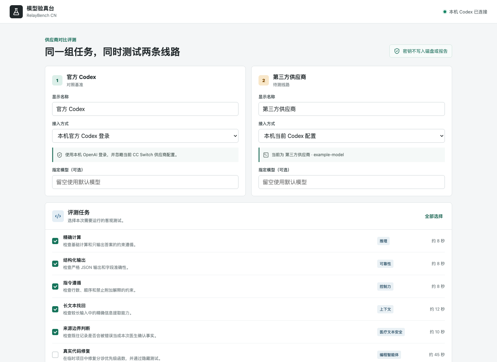
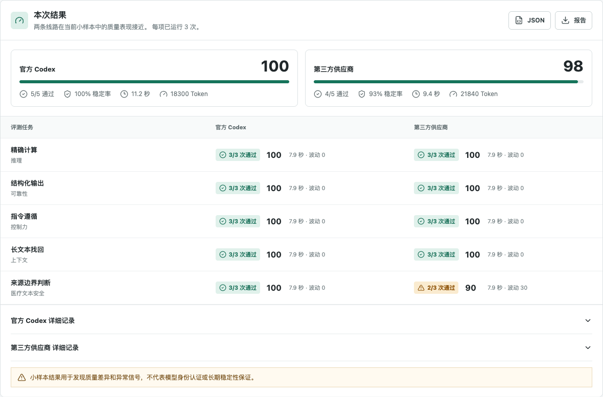
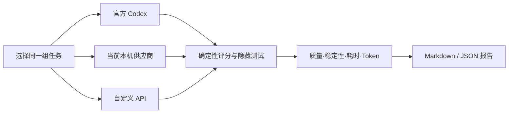

# RelayBench CN · 模型验真台

一个本地优先的中文 LLM/Codex 对比评测工具。它用同一组客观任务，同时比较官方 Codex、本机当前供应商与 OpenAI-compatible API，记录质量、稳定性、耗时和 Token 使用。



## 为什么做这个项目

第三方模型中转或低价 API 往往只展示模型名称，但名称、自我描述和响应头都可能被改写。RelayBench CN 不尝试“证明模型身份证”，而是用可重复任务回答更实际的问题：

- 同一任务能否稳定完成？
- 隐藏代码测试能否通过？
- 医疗文本中的来源边界是否被混淆？
- 质量、速度与 Token 消耗是否存在持续差异？

## 当前能力

- 官方 Codex 与当前本机供应商并行运行，无需来回切换 CC Switch
- 支持 Responses API 与 Chat Completions API
- 每项可运行 1 次或 3 次，显示通过次数、稳定率与得分波动
- 响应题合并请求，减少重复调用开销
- 代码任务在临时隔离目录执行，不接触用户真实项目
- Markdown 与 JSON 报告导出，API Key 不进入报告或项目文件

### 重复运行结果示例



> 上图为界面展示用模拟数据，用于说明稳定率和波动展示方式，不是真实供应商评测结论。

## 评测任务

| 类型 | 当前任务 | 核心检查 |
|---|---|---|
| 响应 | 精确计算 | 正确性与格式约束 |
| 响应 | 结构化输出 | 严格 JSON 与字段准确性 |
| 响应 | 指令遵循 | 行数、顺序与禁止附加解释 |
| 响应 | 长文本找回 | 较长上下文中的精确信息提取 |
| 响应 | 来源边界判断 | 合成医疗文本中的既往/本次事实区分 |
| 代码 | 真实代码修复 | 边界条件与隐藏测试 |
| 代码 | 事件时间线归一化 | 去重、日期校验、稳定排序与输入不可变性 |

医疗测试仅使用完全合成资料，不包含患者数据，也不用于诊断或治疗决策。

## 工作方式



## 下载 Mac 应用

适用于 Apple 芯片 Mac（M1/M2/M3/M4）：

1. 在 GitHub Releases 下载 `RelayBench-CN-0.2.1-arm64.dmg`；
2. 打开 DMG，把“模型验真台”拖入“应用程序”；
3. 首次打开时，在 Finder 的“应用程序”中右键“模型验真台”，选择“打开”；
4. 后续可直接双击启动，不需要安装 Node.js，也不需要使用命令行。

当前安装包尚未使用 Apple Developer 证书签名，因此首次打开会出现 macOS 安全提示。应用只在本机启动服务，评测密钥不会写入磁盘或报告。

### 使用条件

- 比较“官方 Codex”：本机需要安装 ChatGPT Mac 应用并已登录可用账号；
- 比较“当前 CC Switch 供应商”：本机需要已经通过 CC Switch 配置 Codex；
- 比较“自定义 API”：填写 OpenAI-compatible API 地址、模型 ID 和自己的 Key；这一模式不要求安装 Codex；
- 普通 HTTP API 目前只运行响应题，代码仓库修改任务需要 Codex 环境。

## 从源码运行

要求：Node.js 22+。官方 Codex 和本机供应商对比目前以 macOS 为主要运行环境。

```bash
git clone https://github.com/longjianw/relaybench-cn.git
cd relaybench-cn
npm install
npm run build
npm start
```

打开 `http://127.0.0.1:8787`。

开发模式：

```bash
npm run dev
```

### 从源码安装旧版 Mac 启动器

```bash
npm run app:install
```

执行后，桌面会出现 `模型验真台.app`。双击即可启动本机服务并打开固定地址 `http://127.0.0.1:8790`。

停止后台服务：

```bash
npm run app:stop
```

## 验证

```bash
npm run typecheck
npm test
npm run build
```

当前自动测试覆盖评分器、重复运行聚合与“偶发失败不能被高平均分掩盖”的统计规则。

## 安全与边界

- 自定义 API Key 只参与当前请求，不写入源码、配置文件或导出报告
- 本机供应商信息在运行时读取，不进入仓库
- 代码任务使用一次性临时目录，完成后删除
- 结果只能说明指定任务上的表现，不能作为模型身份的密码学证明
- 当前不是生产级模型治理平台，也没有宣称临床有效性

安全说明见 [SECURITY.md](SECURITY.md)，评测设计见 [docs/benchmark-design.md](docs/benchmark-design.md)。

## 问题反馈

应用右上角的“反馈问题”会打开 GitHub Issues 分类页，也可以直接访问 [提交问题或建议](https://github.com/longjianw/relaybench-cn/issues/new/choose)：

- 安装或运行问题；
- 供应商/API 兼容问题；
- 新评测任务建议。

提交前请删除 API Key、Bearer Token、患者信息、未经脱敏的本机配置和日志。可能导致密钥暴露或越界执行的安全漏洞不要公开发 Issue，请按 [SECURITY.md](SECURITY.md) 使用 GitHub 私密安全报告。

## 开发方式与贡献说明

本项目由龙建伟从真实的第三方模型使用需求出发，提出产品问题、评测指标、医疗安全场景和验收方向；代码实现与迭代在 AI 编程工具协助下完成。项目不把“使用 AI 开发”包装成独立手写全部代码，重点展示的是问题定义、评测设计、产品判断与可验证交付。

## 路线图

- 完成受控的 3 次真实供应商对照
- 增加模型替换、提示词注入与异常响应检测
- 接入可扩展评测集与本地历史趋势
- 为 Mac 安装包增加 Apple 签名、公证和 Intel 版本
- 发布不调用真实模型的在线展示页

## 维护与学习

第一次维护 GitHub 项目可阅读 [docs/GITHUB_GUIDE_ZH.md](docs/GITHUB_GUIDE_ZH.md)。

## License

[MIT](LICENSE)
